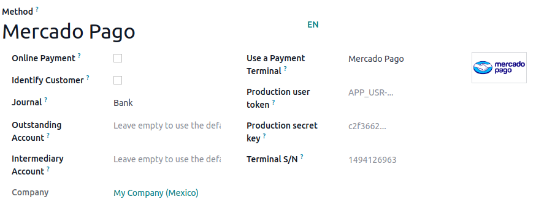

============
Mercado Pago
============

Connecting a payment terminal allows you to offer a fluid payment flow to your customers and ease
the work of your cashiers.

.. important::
   - Odoo only supports the **Point Smart** payment terminal that can be purchased on `Mercado
     Pago's website <https://www.mercadopago.com.mx/herramientas-para-vender/lectores-point>`_.
   - Point Smart can only be used in LATAM (Latin America) countries.

.. seealso::
   - `Mercado Pago online payment <https://www.mercadopago.com.mx/herramientas-para-vender/check-out#benefits-checkout>`_

Configuration
=============

Start by creating your `Mercado Pago account <https://www.mercadopago.com.mx/>`_ and associate your
terminal with a :guilabel:`store` and a :guilabel:`cash drawer` by following the Mercado pago's documentation.

Then, ensure your Point Smart terminal is set to :guilabel:`Point of Sale` by going to [ASK MOOL]

.. raw:: html

    <embed>

        
 <b> --> ASK MOOL </b>

    </embed>

.. warning::
   Point Smart terminal has two modes of operation: "Standalone" and "Point of Sale". Be sure your
   terminal is configured on the "Point of Sale" mode, Odoo does not support the "Standalone" mode.

.. note::
   - All the purchased terminals are automatically available on your Mercado dashboard.
   - Odoo doesn't use the Mercado Pago *store* and *cash drawer* associated with your terminal,
     these functionalities are provided by Mercado Pago for their system management

.. seealso::
   `Mercado Pago's documentation page <https://www.mercadopago.com.mx/developers/en/docs>`_

.. _mercado_pago/credentials:

Generate your credentials
-------------------------

To configure your Point Smart terminal with the Odoo system you'll need three credentials:

- An :ref:`access token <mercado_pago/token>` used by Odoo to call Mercado Pago.
- A :ref:`webhook secret key <mercado_pago/webhook>` used by Odoo to authenticate notifications
  sent by Mercado Pago.
- The **terminal serial number** used to identify the terminal. You can find it at the back of
  your terminal.

To retrieve the first two fields, go to the `Mercado Pago developers website
<https://www.mercadopago.com.mx/developers/en>`_, and click :guilabel:`Your integrations` in the
navigation menu/footer. Then, select the integration you've created beforehand or create one.

.. _mercado_pago/token:

The access token
~~~~~~~~~~~~~~~~

From your integration, click :guilabel:`Production credentials` on the left navigation menu, then
click the eye icon to reveal the access token. Copy and save the key to paste it into the Odoo
:guilabel:`Production user token` field at :ref:`the payment method creation <mercado_pago/method>`.

.. raw:: html

    <embed>

        
 <b> NEEDS SCREENSHOT </b>

    </embed>

.. _mercado_pago/webhook:

The webhook secret key
~~~~~~~~~~~~~~~~~~~~~~

From your integration, click :guilabel:`Webhook` on the left navigation menu. Then, go to the
:guilabel:`production mode` tab and click the eye icon to reveal the webhook secret key. Copy and
save the key to paste it into the Odoo :guilabel:`Production secret key` field at :ref:`the payment
method creation <mercado_pago/method>`.

On the same page, set up the production URL field by filling it in using your domain name followed
by `/pos_mercado_pago/notification` (e.g., `https://www.myshop.com/pos_mercado_pago/notification`).

.. raw:: html

    <embed>

        
 <b> NEEDS SCREENSHOT </b>

    </embed>

.. _mercado_pago/method:

Configure the Payment Method
----------------------------

Enable the payment terminal :ref:`in the application settings <configuration/settings>` and
:doc:`create the related payment method <../../payment_methods>`. Set the journal type as
:guilabel:`Bank` and select :guilabel:`Mercado Pago` in the :guilabel:`Use a Payment Terminal` field.

Finally, fill in the mandatory fields with the :ref:`previously generated credentials
<mercado_pago/credentials>`:

- Fill in the :guilabel:`Production user token` field using the :ref:`access token
  <mercado_pago/token>`.
- Fill in the :guilabel:`Production secret key` field using the :ref:`webhook secret key
  <mercado_pago/webhook>`
- Fill in the :guilabel:`Terminal S/N` field using the terminal serial number. You can find it at
  the back of your terminal.

Once the payment method is created, you can select it in your POS settings. To do so, go to the
:ref:`POS' settings <configuration/settings>`, click :guilabel:`Edit`, and add the payment method
under the :guilabel:`Payments` section.

Pay with a payment terminal
===========================

When processing a payment, select your Mercado Pago payment method, check the amount and
click on :guilabel:`Send`. Once the payment is successful, the status changes to :guilabel:`Payment
Successful`.

.. note::
   - | In case of connection issues between Odoo and the payment terminal, force the payment by
       clicking on :guilabel:`Force Done`, which allows you to validate the order.
     | This option is only available after receiving an error message informing you that the
       connection failed.
   - To cancel the payment request, click on :guilabel:`cancel`.

.. important::
   Proceed with the payment on the terminal, whatever the action taken on the terminal you **MUST**
   receive a notification on the PoS interface, see Troubleshooting section in case of missing
   notification

.. raw:: html

    <embed>

        
 <b> --> ASK MOOL </b>

    </embed>

Troubleshooting
===============

#. When configuring the payment method, on save you get the message:

   - **Invalid Operation** Please verify your production user token as it was rejected"
     - You misspelled the token or you took the wrong one
   - **Invalid Operation** The terminal serial number is not registered on Mercado Pago"

     - You misspelled the terminal serial number or you took the wrong one, a serial number is only
       composed of digits

#. Can't add your payment method in :menuselection:`Configuration --> Settings --> Payment`:

   - Please close all open sessions before trying to add/delete a payment method
#. No notifications received on the PoS interface:

   - This is likely a misspelled webhook secret key entered in your payment method configuration or the
     **Set the production URL field** in :ref:`mercado_pago/credentials` doesn't contains the right url

